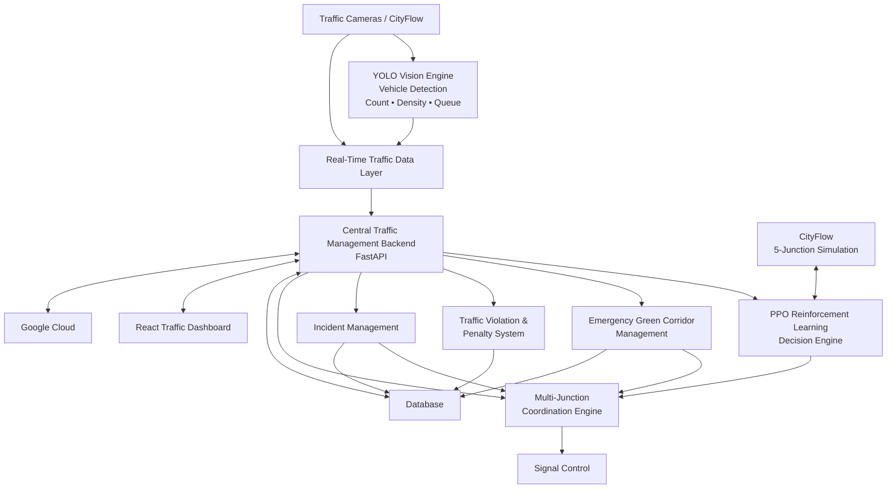

# 🚦 Intelligent Traffic Management System

<p align="center">

**AI-Driven • Data-Driven • Connected • Adaptive Traffic Management**

A next-generation intelligent traffic management system designed to coordinate multiple connected traffic junctions using **Reinforcement Learning, Computer Vision, Emergency Vehicle Prioritization, Automated Traffic Violation Detection, and Cloud Infrastructure**.

<br>


</p>

---

## 🌐 Overview

Traditional traffic signal systems primarily depend on **predefined and fixed signal timings**. Such systems cannot effectively respond to continuously changing traffic conditions such as sudden congestion, unequal traffic flow, accidents, or emergency vehicles.

The **Intelligent Traffic Management System (ITMS)** aims to replace or augment fixed-time traffic control with an **AI-driven adaptive traffic management network**.

The system continuously analyzes traffic conditions, dynamically optimizes traffic signals, coordinates multiple junctions, prioritizes emergency vehicles, manages incidents, detects traffic violations, generates digital penalty records, and provides centralized monitoring through a real-time dashboard.

The primary objective is to create a connected network of **at least five traffic junctions** that behaves as **one intelligent traffic management system rather than five independent smart signals**.

---

# 🎯 Why This Project?

Modern cities face several traffic-management challenges:

* 🚗 Increasing traffic density
* 🚦 Fixed signal timings
* 🚧 Unexpected congestion
* 🚑 Delays for emergency vehicles
* 🚨 Traffic signal violations
* 💥 Accidents and road blockages
* 🔄 Poor coordination between neighboring junctions
* 📊 Limited real-time traffic intelligence
* ☁️ Lack of centralized traffic monitoring

Our system addresses these challenges by combining **AI, simulation, computer vision, real-time communication, and cloud infrastructure** into one integrated platform.

### Core Idea

Instead of:

```text
Junction 1 → Independent
Junction 2 → Independent
Junction 3 → Independent
Junction 4 → Independent
Junction 5 → Independent
```

we create:

```text
        ┌───── J1 ─────┐
        │              │
        ▼              │
        J2 ←───────────┘
        │
        ▼
        J3
        │
        ▼
        J4
        │
        ▼
        J5

     Connected Intelligent
      Traffic Network
```

Each junction shares relevant traffic information with neighboring junctions so that the entire corridor can make coordinated decisions.

---

# ✨ Key Features

### 🤖 AI-Based Adaptive Traffic Signals

Uses **PPO-based Reinforcement Learning** to dynamically optimize traffic signal decisions based on real-time traffic conditions.

### 🔗 Multi-Junction Coordination

Coordinates at least **five interconnected traffic junctions** instead of treating each junction independently.

### 🚑 Dynamic Emergency Green Corridor

Automatically generates a temporary green corridor for emergency vehicles such as:

* Ambulances
* Fire trucks
* Police vehicles

### 🚨 Multiple Emergency Vehicle Handling

Detects conflicting emergency movements and prevents conflicting green corridors from being activated simultaneously.

### 💥 Intelligent Incident Management

Handles accidents and road blockages by restricting affected traffic, coordinating nearby junctions, redistributing traffic, and entering recovery mode.

### 👁️ AI Traffic Vision

Uses **YOLO** and computer vision to extract:

* Vehicle count
* Vehicle type
* Traffic density
* Queue length
* Lane occupancy
* Vehicle movement

### 🚦 Automated Traffic Violation Detection

Detects red-light and configurable signal-related violations using computer vision.

### 🔠 Number Plate Recognition

Uses an OCR/ANPR pipeline to identify the registration number of violating vehicles.

### 💰 Digital Penalty System

Creates a digital violation and penalty record with evidence, junction information, timestamp, signal state, and vehicle registration number.

### ☁️ Cloud-Connected Architecture

Uses **Google Cloud** for appropriate backend, storage, database, deployment, communication, and monitoring requirements.

### 📊 Central Traffic Dashboard

Provides a centralized real-time view of:

* Five junctions
* Traffic conditions
* Signal states
* AI decisions
* Emergency vehicles
* Green corridors
* Incidents
* Violations
* Penalty records
* System performance

---

# 🏗️ System Architecture



---

# 🔄 Overall System Workflow

The complete system follows:

```text
Traffic Environment
        │
        ▼
Traffic Camera / CityFlow
        │
        ▼
YOLO / Traffic Data
        │
        ▼
Real-Time Traffic State
        │
        ▼
Central Coordination Layer
        │
        ├───────────────┐
        │               │
        ▼               ▼
    Normal Mode     Special Events
        │               │
        ▼          ┌────┼────┐
      PPO          │    │    │
        │          ▼    ▼    ▼
        │       Emergency Accident Violation
        │       Corridor   Management
        │
        └───────────┬─────────────┘
                    ▼
          Multi-Junction Coordinator
                    │
                    ▼
             Signal Controller
                    │
                    ▼
             Traffic Network
                    │
                    ▼
              New Traffic State
                    │
                    └──────► PPO
```

---

# 🧠 Four Major Project Modules

The project is divided into four primary development areas.

```text
┌─────────────────────────────────────────────────────┐
│          INTELLIGENT TRAFFIC MANAGEMENT             │
├─────────────────┬─────────────────┬─────────────────┤
│                 │                 │                 │
│ Green Corridor  │ Simulation +    │ Penalty System  │
│                 │ PPO             │                 │
│ Emergency      │ CityFlow        │ YOLO            │
│ Vehicles       │ Reinforcement   │ Violation       │
│                 │ Learning        │ OCR / ANPR      │
│                 │                 │                 │
└─────────────────┴─────────────────┴─────────────────┘
                         │
                         ▼
              Coordination + Cloud
              Backend • Database
              Dashboard • GCP
```

---

# 🚑 1. Green Corridor & Emergency Vehicle Management

### Purpose

The Green Corridor module provides **dynamic priority to emergency vehicles** by coordinating traffic signals along their route.

Emergency vehicles are treated as high-priority traffic.

Supported emergency vehicles include:

* 🚑 Ambulance
* 🚒 Fire truck
* 🚓 Police / emergency response vehicle

---

## Green Corridor Workflow

```text
Emergency Vehicle
        │
        ▼
Emergency Detection
        │
        ▼
Current Location
        │
        ▼
Route / Movement Identification
        │
        ▼
Upcoming Junction Detection
        │
        ▼
Priority Request
        │
        ▼
Junction Coordination
        │
        ▼
Dynamic Green Corridor
        │
        ▼
J1 → J2 → J3 → J4
        │
        ▼
Emergency Vehicle Passes
        │
        ▼
Corridor Released
        │
        ▼
Normal Traffic Control
```

---

## Multiple Emergency Vehicles

The system must handle multiple emergency vehicles arriving simultaneously.

### Non-conflicting movement

If emergency vehicles do not have conflicting movements, the system may accommodate both safely.

```text
AMB-01 ───────────────►

                     Junction

FIRE-01 ─────────────►
```

### Conflicting movement

If their movements conflict:

```text
AMB-01
   │
   ▼
   J3
   ▲
   │
FIRE-01
```

the system handles them sequentially.

Initial priority:

```text
First detected / arrived
          ↓
      First priority
          ↓
Vehicle clears conflict
          ↓
Second vehicle
          ↓
Second priority
```

The system must never create two conflicting green corridors simultaneously.

---

# 🤖 2. Traffic Simulation & PPO Model Training

## CityFlow

**CityFlow** is used as the primary traffic simulation environment.

The simulation will contain at least five connected junctions:

```text
J1 ─── J2 ─── J3 ─── J4 ─── J5
```

The simulation will support:

* Low traffic
* Normal traffic
* Heavy traffic
* Unequal traffic
* Sudden congestion
* Emergency vehicles
* Traffic violations
* Accidents
* Road blockages
* Multiple emergency vehicles

---

## Reinforcement Learning

The project uses:

**PPO — Proximal Policy Optimization**

The learning loop is:

```text
Traffic State
      │
      ▼
   PPO Agent
      │
      ▼
Signal Action
      │
      ▼
   CityFlow
      │
      ▼
Traffic Changes
      │
      ▼
New Traffic State
      │
      └──────────► PPO Agent
```

---

## PPO State

The state can include:

```text
Vehicle Count
Traffic Density
Queue Length
Waiting Time
Traffic Flow
Current Signal Phase
Vehicle Arrival Rate
Neighboring Junction Traffic
```

---

## PPO Actions

Possible actions include:

```text
Keep Current Phase
Switch Phase
Extend Green
Reduce Green
Change Signal Timing
```

The final action-space design will be determined during implementation and experimentation.

---

## Reward Function

The PPO agent should learn to:

### Minimize

* Waiting time
* Queue length
* Congestion
* Travel time
* Junction delay

### Maximize

* Traffic throughput
* Junction efficiency
* Traffic flow continuity
* Multi-junction coordination

---

## Model Evaluation

The AI controller will be evaluated against a traditional fixed-time controller.

```text
┌─────────────────────────────┐
│ Traditional Fixed Timing    │
└──────────────┬──────────────┘
               │
               VS
               │
┌──────────────▼──────────────┐
│ PPO Adaptive Controller     │
└─────────────────────────────┘
```

---

# 🚨 3. Automated Traffic Violation & Penalty System

The Penalty System automatically detects traffic signal violations and creates digital penalty records.

The primary violation is:

**Red-Light Violation**

---

## Violation Detection Pipeline

```text
Camera
  │
  ▼
YOLO Vehicle Detection
  │
  ▼
Vehicle Tracking
  │
  ▼
Signal State Verification
  │
  ▼
Stop-Line Detection
  │
  ▼
Vehicle Crosses Stop Line
  │
  ▼
Violation Confirmed
  │
  ▼
Number Plate Detection
  │
  ▼
OCR / ANPR
  │
  ▼
Vehicle Registration Number
  │
  ▼
Violation Record
  │
  ▼
Digital Penalty
```

---

## Violation Record

Each violation can contain:

```text
Violation ID
Vehicle Number
Junction ID
Violation Type
Date / Time
Evidence Image
Signal State
Penalty Status
```

Example:

```json
{
  "vehicle_number": "MH12AB1234",
  "junction_id": "J3",
  "violation_type": "RED_LIGHT",
  "signal_state": "RED",
  "timestamp": "2026-08-12T17:30:00",
  "penalty_status": "GENERATED"
}
```

> **Note:** The prototype will generate a simulated/digital penalty record. It does not claim direct legal enforcement integration.

---

# 💥 4. Incident & Accident Management

The system can enter **Incident Mode** when an accident or road blockage occurs.

Example:

```text
Accident occurs on EAST approach
              │
              ▼
Affected Direction Identified
              │
              ▼
Traffic entering affected area restricted
              │
              ▼
Safe traffic movements identified
              │
              ▼
Traffic redirected where possible
              │
              ▼
Nearby junctions coordinated
              │
              ▼
Emergency responders given access
              │
              ▼
Incident Cleared
              │
              ▼
Recovery Mode
              │
              ▼
Normal PPO Control
```

---

# 🚦 System Operating Modes

## 🟢 Normal Mode

PPO optimizes normal traffic signal operations.

```text
Traffic Data
     ↓
PPO
     ↓
Signal Decision
     ↓
Multi-Junction Coordination
```

## 🔴 Emergency Mode

Emergency vehicles receive priority.

```text
Emergency Vehicle
        ↓
Route
        ↓
Green Corridor
        ↓
Priority Signals
```

## 🟠 Incident Mode

Traffic is dynamically managed around accidents and road blockages.

## 🔵 Recovery Mode

The system clears accumulated congestion before gradually returning to normal AI-based control.

## ⚠️ Manual / Safety Override

A human operator can override automated decisions whenever necessary.

**Safety always takes priority over AI optimization.**

---

# ☁️ 5. Coordination, Backend & Cloud

This is the central integration layer of the project.

It connects:

```text
PPO
 │
 ├── Green Corridor
 │
 ├── Penalty System
 │
 ├── Incident Management
 │
 └── Traffic Data
          │
          ▼
   Central Backend
          │
    ┌─────┴─────┐
    ▼           ▼
 Database    Dashboard
    │           │
    └─────┬─────┘
          ▼
     Google Cloud
```

---

## Backend

Primary backend technology:

**Python + FastAPI**

Responsibilities:

* Traffic data ingestion
* Junction management
* Signal-state management
* Emergency events
* Green corridor coordination
* Incident management
* Violation events
* PPO communication
* Database communication
* Dashboard APIs
* Real-time communication

---

# 🔌 Communication Architecture

The system will use a combination of:

### REST APIs

For standard operations:

```text
GET  /junctions
GET  /traffic
GET  /violations
GET  /emergency/status

POST /traffic/update
POST /emergency
POST /violation
POST /incident
```

### WebSockets

For real-time updates:

```text
Traffic Updates
Signal Changes
Emergency Status
Green Corridor Status
Incident Alerts
Violation Alerts
Junction Communication
```

---

# 🗄️ Database

The database stores:

```text
Junction Information
Traffic Records
Signal States
Emergency Events
Green Corridor Events
Traffic Violations
Penalty Records
Incident Records
System Events
Performance Metrics
```

---

# 🖥️ Central Traffic Dashboard

The React dashboard provides a centralized view of the complete traffic network.

Example:

```text
┌──────────────────────────────────────────────────────┐
│          INTELLIGENT TRAFFIC DASHBOARD               │
├──────────────────────────────────────────────────────┤
│                                                      │
│  J1        J2        J3        J4        J5          │
│  🟢        🟡        🔴        🟢        🟢           │
│                                                      │
│  Traffic Density                                     │
│  ███████████████░░░░                                 │
│                                                      │
│  🚑 Emergency: AMB-01                                │
│  🟢 Green Corridor: J1 → J2 → J3 → J4               │
│                                                      │
│  🚨 Violation: MH12AB1234                            │
│                                                      │
│  ⚠️ Incident: J4 East Road                           │
│                                                      │
└──────────────────────────────────────────────────────┘
```

---

# ☁️ Google Cloud

Google Cloud will be used according to actual project requirements.

Potential applications include:

* Cloud backend deployment
* Database
* Data storage
* Real-time communication
* Monitoring
* Traffic data processing
* Video-related services
* System infrastructure

### Google Maps Platform

Potential uses:

* Junction visualization
* Road-network visualization
* Emergency route visualization
* Green corridor visualization
* Connected-junction visualization

We will **not force the use of a cloud service simply because it is available**. Each service will be selected based on technical requirements, cost, latency, scalability, and suitability.

---

# 🛠️ Technology Stack

| Category               | Technology                | Purpose                                |
| ---------------------- | ------------------------- | -------------------------------------- |
| Programming            | **Python**                | AI, simulation integration and backend |
| Reinforcement Learning | **PPO**                   | Adaptive signal optimization           |
| Deep Learning          | **PyTorch**               | RL/ML implementation                   |
| RL Framework           | **Stable-Baselines3**     | PPO implementation if appropriate      |
| Traffic Simulation     | **CityFlow**              | Five-junction traffic simulation       |
| Computer Vision        | **YOLO**                  | Vehicle detection                      |
| Image Processing       | **OpenCV**                | Video/image processing                 |
| Number Plate           | **OCR / ANPR**            | Registration-number recognition        |
| Backend                | **FastAPI**               | APIs and system integration            |
| Communication          | **WebSocket**             | Real-time updates                      |
| Frontend               | **React.js**              | Traffic dashboard                      |
| Database               | **Relational / Cloud DB** | System data storage                    |
| Cloud                  | **Google Cloud**          | Deployment and infrastructure          |
| Maps                   | **Google Maps Platform**  | Route and junction visualization       |
| Version Control        | **Git + GitHub**          | Team development                       |

---

# 📁 Repository Structure

```text
intelligent-traffic-management-system/
│
├── README.md
├── CONTRIBUTING.md
├── LICENSE
├── .gitignore
├── .env.example
│
├── docs/
│   ├── architecture/
│   ├── api/
│   ├── research/
│   └── meetings/
│
├── simulation/
│   ├── cityflow/
│   ├── scenarios/
│   ├── configs/
│   └── README.md
│
├── rl/
│   ├── environment/
│   ├── agents/
│   ├── training/
│   ├── evaluation/
│   └── README.md
│
├── green-corridor/
│   ├── emergency_detection/
│   ├── routing/
│   ├── coordination/
│   └── README.md
│
├── penalty-system/
│   ├── vehicle-detection/
│   ├── violation-detection/
│   ├── plate-detection/
│   ├── ocr/
│   └── README.md
│
├── backend/
│   ├── app/
│   ├── api/
│   ├── models/
│   ├── services/
│   └── README.md
│
├── dashboard/
│   ├── src/
│   ├── public/
│   └── README.md
│
├── database/
│   ├── schema/
│   ├── migrations/
│   └── README.md
│
├── tests/
│
└── scripts/
```

---


# 🔗 Module Integration

Each module must have clearly defined inputs and outputs.

### PPO → Backend

```text
Traffic State
      ↓
PPO
      ↓
Signal Decision
      ↓
Backend
```

### Green Corridor → Backend

```text
Emergency Event
      ↓
Route
      ↓
Affected Junctions
      ↓
Backend
```

### Penalty System → Backend

```text
Violation Event
      ↓
Vehicle Number
      ↓
Evidence
      ↓
Backend
      ↓
Database
```

### Backend → Dashboard

```text
Backend
   ↓
WebSocket / API
   ↓
React Dashboard
```

---

# 📊 Performance Metrics

The system will be evaluated using measurable metrics rather than subjective claims.

### Traffic Performance

* Average waiting time
* Average queue length
* Average travel time
* Traffic throughput
* Junction delay
* Congestion level

### Emergency Performance

* Emergency vehicle delay
* Green corridor travel time
* Corridor establishment time
* Emergency clearance time

### Incident Performance

* Incident response time
* Traffic redistribution efficiency
* Incident recovery time

### Computer Vision

* Vehicle detection accuracy
* Violation detection accuracy
* Number plate recognition accuracy

### System Performance

* AI decision latency
* Junction-to-junction communication latency
* API response time
* System reliability

---

# 🧪 Final Demonstration

The final demonstration will combine all major modules into one scenario:

```text
1. Normal traffic begins
          ↓
2. PPO dynamically controls signals
          ↓
3. Traffic increases at J1
          ↓
4. J1 shares information with J2
          ↓
5. Five junctions coordinate
          ↓
6. Traffic flows through the network
          ↓
7. Emergency vehicle appears
          ↓
8. Dynamic green corridor generated
          ↓
9. Emergency vehicle passes
          ↓
10. Normal traffic optimization resumes
          ↓
11. Accident occurs
          ↓
12. Affected traffic is restricted
          ↓
13. Traffic is redistributed
          ↓
14. Recovery mode begins
          ↓
15. Red-light violation occurs
          ↓
16. YOLO detects vehicle
          ↓
17. Number plate is extracted
          ↓
18. OCR recognizes registration number
          ↓
19. Digital penalty record generated
          ↓
20. Dashboard displays complete event
          ↓
21. Five-junction network continues operating
```

---

# 🗺️ Development Roadmap

```text
Phase 1
Project Architecture
        ↓
Phase 2
Single Junction Simulation
        ↓
Phase 3
PPO Training
        ↓
Phase 4
Five-Junction Network
        ↓
Phase 5
Multi-Junction Coordination
        ↓
Phase 6
Emergency Green Corridor
        ↓
Phase 7
Violation + OCR + Penalty
        ↓
Phase 8
Incident Management
        ↓
Phase 9
Backend + Dashboard
        ↓
Phase 10
Google Cloud Integration
        ↓
Phase 11
Testing + Evaluation
        ↓
Final Integrated Demonstration
```

---

# 🔬 Research Potential

The system can provide a foundation for further research in:

* Multi-junction reinforcement learning
* Multi-agent traffic control
* Dynamic green-wave optimization
* Emergency vehicle prioritization
* Accident-aware traffic signal control
* Traffic propagation prediction
* Real-time intelligent transportation systems
* Computer-vision-based traffic enforcement
* Low-latency traffic coordination
* Cloud-assisted traffic management
* Edge AI for traffic systems

The project can potentially support an **IEEE research publication or patent-oriented work** if the final implementation introduces a clearly defined technical contribution and demonstrates measurable improvement against appropriate baseline systems.

---

# 🔐 Safety Principle

The system follows one fundamental rule:

> **Safety takes priority over AI optimization.**

PPO should optimize normal traffic conditions, but it should operate within defined safety and coordination constraints.

The system should also provide:

* Human override
* Safe signal transitions
* Conflict prevention
* Emergency priority rules
* Incident handling rules

---

# 🚀 Project Status

**🚧 Under Development**

### Current Target

Build a technically realistic:

> **AI-driven, data-driven, connected five-junction intelligent traffic management system.**

### Core Technologies

```text
CityFlow
   +
PPO / Reinforcement Learning
   +
YOLO / Computer Vision
   +
OCR / ANPR
   +
FastAPI
   +
React
   +
Database
   +
Google Cloud
   =
Intelligent Traffic Management System
```

---

# 📜 License

This project is licensed under the **Apache License 2.0**.

See [`LICENSE`](LICENSE) for more information.

---

# 👨‍💻 Team

**Intelligent Traffic Management System**

Developed as a collaborative project focused on applying **Artificial Intelligence, Reinforcement Learning, Computer Vision, Cloud Computing, and Intelligent Transportation Systems** to real-world traffic-management challenges.

---

<p align="center">

### 🚦 Building Smarter Roads.

### 🤖 Connecting Intelligent Junctions.

### 🚑 Saving Time When Every Second Matters.

## Author

### Ayush Kale

Computer Engineering Student passionate about AI, Computer Vision, and Machine Learning.

[](https://github.com/Imposter069)
[](https://www.linkedin.com/in/ayush-kale-905882335/)
[](mailto:kaleayush2006@gmail.com)


</p>
